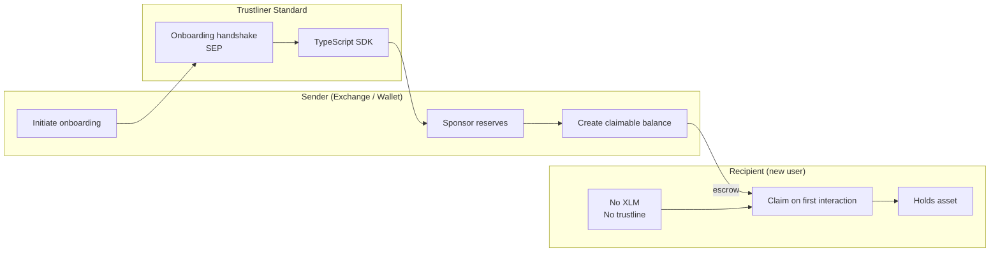

# SCF Build Award — RFP Track Proposal

## Project: Trustliner

> A standard enabling exchanges and wallets to onboard users to Stellar assets
> without manual trustline setup, with a reference implementation, SDKs, and a
> "Welcome to Stellar" landing page.

**RFP:** [Trustliner](https://stellar.gitbook.io/scf-handbook/scf-awards/build-award/rfp-track)
**Track:** Build Award — RFP Track
**Target completion:** Q2 2026
**License:** Apache-2.0 (open-source, built in the open)

---

## 1. Summary

Receiving a non-native Stellar asset (USDC, EURC, an anchor's token) requires a
funded account *and* a pre-established trustline. New users from exchanges and
fresh wallets have neither. Trustliner defines an **open standard** plus
production tooling so a sender can deliver an asset to a recipient who has done
nothing in advance — no XLM, no trustline, no manual setup.

We compose three existing Stellar primitives — **sponsored reserves (CAP-33)**,
**claimable balances**, and a new **standard onboarding handshake (SEP draft)** —
so v1 ships on mainnet today with no protocol change required.

## 2. Problem & motivation

The two-step gate (fund with XLM → add trustline) is the single largest drop-off
point in Stellar asset onboarding:

- Exchanges withdrawing USDC to Stellar must instruct users to acquire XLM and add a
  trustline first — a step most users abandon or get wrong.
- Wallets cannot present a working "receive" address until the user has already been
  onboarded, creating a cold-start problem.
- Each integrator solves this with bespoke, non-interoperable logic.

A shared standard turns a per-integration engineering problem into a one-time protocol
adoption, and unlocks consistent UX across the ecosystem.

## 3. Proposed solution

A standard with three coordinated parts:

1. **Onboarding handshake (SEP draft).** A documented request/authorize protocol by
   which a wallet or exchange initiates onboarding for a recipient and a sender/issuer
   responds. Defines message formats, endpoints, signing, and error semantics.
2. **Sponsored, trustline-free delivery.** Using sponsored reserves the sender pays the
   recipient's base + trustline reserve; the asset is escrowed as a claimable balance
   and settled on the recipient's first interaction. Recipient needs zero XLM.
3. **Reference flows + SDK.** Issuer-side and recipient-side reference implementations,
   plus a minimal TypeScript SDK for wallet and exchange integration.

Design alternatives considered and documented in [`../standard/`](../standard):
authorize-trustline interface, temporary intermediary accounts, auto-generated
claimable balances. Trade-offs (custody, reserve cost, reversibility, UX) are compared
there.

## 4. Architecture

See [`architecture.md`](./architecture.md) for the full Mermaid diagram and
plain-English walkthrough. High-level:

## 5. Deliverables

Mapped directly to the RFP's required deliverables:

| RFP deliverable | This project |
| --- | --- |
| Published standard (CAP or SEP) | [`standard/`](../standard) — SEP draft + rationale |
| Reference implementation (issuer + recipient flows) | [`packages/reference/`](../packages/reference) |
| SDK / libraries for wallet & exchange integration | [`packages/sdk/`](../packages/sdk) |
| Documentation, test suite, example integrations | [`docs/`](../docs) + per-package tests |
| "Welcome to Stellar" landing page | [`apps/welcome/`](../apps/welcome) |
| Production-ready version | Milestone M5 (see below) |

## 6. Milestones

Full breakdown with acceptance criteria and tranche mapping in
[`milestones.md`](./milestones.md). Summary:

| # | Milestone | Outcome |
| --- | --- | --- |
| M1 | Standard draft v0.1 | SEP draft published, community RFC opened |
| M2 | Reference implementation | Issuer + recipient flows on testnet |
| M3 | SDK alpha | TypeScript SDK for wallets & exchanges |
| M4 | Landing page + docs | "Welcome to Stellar" page, integration guides |
| M5 | Production-ready | Mainnet, hardened, test suite, ≥1 integration commitment |

## 7. Maintenance plan

See [`maintenance.md`](./maintenance.md). Summary: standard stewarded through the
Stellar SEP process; SDK published to npm with semantic versioning; CI, issue triage,
and security disclosure policy; sustainability via integrator support and follow-on
ecosystem funding where appropriate.

## 8. Decentralization rationale

The standard introduces **no new trusted intermediary**. Onboarding uses native
Stellar primitives (sponsored reserves, claimable balances) executed by the sender the
user already transacts with; custody is never transferred to a third party. The SEP and
all code are open-source and self-hostable, so any wallet or exchange can implement it
independently. The only centralized component is the optional hosted landing page, which
holds no keys and no user funds. Full discussion in [`decentralization.md`](./decentralization.md).

## 9. Infrastructure

- **Standard & SDK:** static artifacts (markdown + npm package), no runtime infra.
- **Reference implementation:** runs against public Stellar Horizon / RPC; no custom
  backend required for the core flow.
- **Landing page:** static/edge-rendered site, no key custody, no user data store.

Details and a deployment topology diagram in [`infrastructure.md`](./infrastructure.md).

## 10. User privacy

No personal data is required by the standard. The reference tooling and landing page
collect no PII and store no keys; any analytics are privacy-preserving and opt-in.
Policy in [`privacy.md`](./privacy.md).

## 11. Tech stack

- **Standard:** SEP/CAP markdown, following Stellar protocol conventions.
- **SDK & reference:** TypeScript on `@stellar/stellar-sdk` (latest stable release).
- **Landing page:** Next.js (App Router).
- **Tooling:** pnpm workspaces, Vitest, TypeScript strict mode, GitHub Actions CI.
- Commitment to track the **latest stable Stellar releases** throughout.

## 12. Fit & track record

> ⚠️ **TODO (applicant):** Fill in team background, prior Stellar / dev-tooling work,
> and links to open-sourced repositories. The RFP weights "Fit & Track Record"
> heavily — see [`track-record.md`](./track-record.md) for the template to complete.

## 13. Community updates

Commitment to regular public status reports (cadence: per milestone, minimum monthly)
posted to the SCF community channels and this repository's `CHANGELOG`/discussions.
Standard development happens in the open via the SEP process and public RFC.

## 14. Ecosystem coordination

The RFP evaluates integration commitments from wallet and exchange partners and
coordination with custodians/exchanges. Tracking sheet and outreach status in
[`ecosystem.md`](./ecosystem.md).

> ⚠️ **TODO (applicant):** Record partner conversations and letters of intent.
