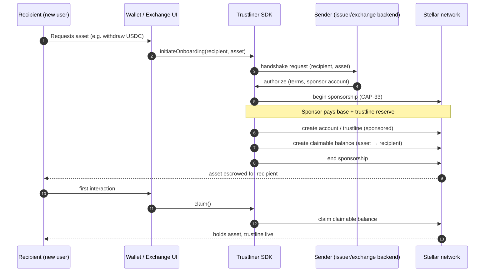

# Architecture

High-level technical architecture for Trustliner, as required by the RFP
(Mermaid diagram + plain-English explanation).

## Goal

Deliver a non-native Stellar asset to a recipient who holds **no XLM** and has **no
trustline**, without transferring custody to a new intermediary and without a protocol
change.

## Components

- **Sender** — an exchange or wallet that already holds the asset and initiates
  onboarding on the recipient's behalf. Pays reserves, never takes recipient custody.
- **Onboarding handshake (SEP)** — the documented protocol: request, authorize, and
  settlement messages exchanged between sender and recipient tooling.
- **TypeScript SDK** — builds the required transactions for both sides; the caller signs.
- **Recipient** — the new user. May not yet have an account on the network.
- **Stellar network primitives** — sponsored reserves (CAP-33) and claimable balances.

## End-to-end flow

## Plain-English walkthrough

1. A new user asks to receive an asset (e.g. an exchange USDC withdrawal to Stellar).
2. The wallet/exchange calls the SDK to start the standard onboarding handshake.
3. The sender authorizes the request and designates a **sponsor** account.
4. Using **sponsored reserves**, the sender pays the recipient's base reserve and the
   0.5 XLM trustline reserve — the recipient needs no XLM of their own.
5. The trustline is established under sponsorship, and the asset is placed in a
   **claimable balance** addressed to the recipient.
6. On the recipient's first interaction, the SDK claims the balance. The user now holds
   the asset with a live trustline, having configured nothing manually.

If onboarding never completes, the sponsor can reclaim the reserves and the claimable
balance, so funds are never stranded.

## Why this composition

- **No protocol change:** ships on mainnet today using existing CAP-33 + claimable
  balances.
- **No new custodian:** the sender is an entity the user already transacts with; keys
  and custody stay with sender and recipient.
- **Reversible:** unclaimed onboarding is fully recoverable by the sponsor.
- **Interoperable:** the SEP makes the handshake identical across all integrators.

Design alternatives and their trade-offs are evaluated in
[`../standard/rationale.md`](../standard/rationale.md).
